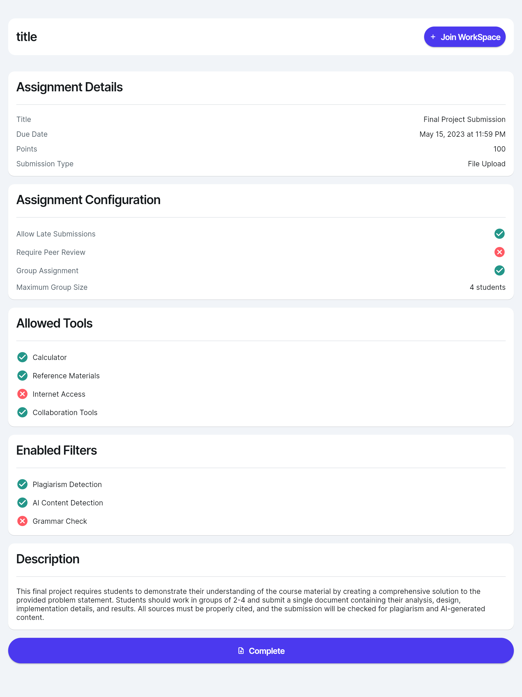

# IntelliClass: Empowering Authentic Learning Through AI-Driven Integrity

> **🚀 Demo:** [intelliclass.kichyassine.me](https://intelliclass.kichyassine.me) is live!

## Introduction

**IntelliClass** is an AI-powered SaaS platform designed to restore integrity in digital education. By addressing vulnerabilities in academic evaluation systems, IntelliClass ensures a fair and secure environment for both professors and students. Through advanced fraud detection mechanisms, secure virtual workspaces, and AI-driven evaluation, IntelliClass combats academic dishonesty and upholds the value of education.


---

## Problem Statement

Academic dishonesty is a growing challenge in the digital age, exacerbated by the rise of online learning and generative AI tools. Traditional supervision and plagiarism detection methods are proving ineffective, leading to compromised fairness, learning quality, and institutional trust.

- **Statistics:**
  - 75%-98% of college students admit to cheating at some point.
  - By 2025, ~43% of students report using AI for academic tasks.

---

## Features

### Professors' Section

1. **Authentication & Profile Management**

   - Secure login with email/password.
   - Manage details like name, subjects, and associated classes.

2. **Classroom & Student Monitoring**

   - View class performance and individual scores.
   - Monitor fraud alerts and detailed logs.

3. **Task Creation & Assignment**

   - Create tasks with plagiarism filters and evaluation criteria.
   - Assign tasks to specific groups/classes.
   - Secure workspace configuration with customizable tools and restrictions.

   

4. **Evaluation & Feedback**

   - Assess submissions using performance and integrity metrics.
   - Provide detailed feedback on originality and quality.

   

### Students' Section

1. **Authentication & Dashboard**

   - Secure login.
   - View assigned tasks, deadlines, and scores.

2. **Secure Workspace**

   - Complete tasks in a virtual environment with preconfigured tools.
   - Restrictions to prevent unauthorized resource access.

3. **Task Submission**

   - Submit assignments securely through the platform.

4. **Feedback & Results**
   - Receive detailed feedback, including fraud detection results.

---

## Technologies

### Frontend

- **Framework:** Flutter (multi-platform, responsive UI).

### Backend

- **Language:** Go (scalable, high-performance APIs).
- **Authentication:** Supabase (secure login, role-based access).
- **Database:** PostgreSQL (multi-tenancy, structured data).

### AI & Machine Learning

- **Language:** Python
- **Fraud Detection Algorithms:**
  - `ai_fraud_score`
  - `jaccard_similarity`
  - `ngram_overlap`
  - `normalized_levenshtein`
  - `tfidf_cosine`


### Deployment

- **Frontend:** Vercel (fast global delivery).
- **Backend:** Google Cloud Platform (scalable, containerized infrastructure).
- **Secure Workspaces:** Fly.io (personalized RDP containers).

---

## Business Model

1. **Target Market**

   - Universities, online education platforms, certification providers.

2. **Revenue Model**

   - Licensing agreements with institutions.
   - Tiered pricing based on features and institution size.

   

3. **Sustainability**
   - Cloud-native architecture for scalability.
   - Multilingual and multi-country support.

---

## Ethical Considerations

- **Data Protection:** Compliance with Morocco’s Law 09-08 and CNDP regulations.
- **Transparency:** Clear consent for monitoring and data use.

---

## Getting Started

### Prerequisites

- Install Docker for secure workspace containers.
- Set up PostgreSQL for database management.
- Register for API access via Supabase.

### Installation

1. Clone the repository:
   ```bash
   git clone [https://github.com/your-repo/IntelliClass](https://github.com/kishyassin/intelliClass-Back-End/).git
   cd IntelliClass-front-end
   License of use: https://www.termsfeed.com/live/29d0c1ad-e5b8-448b-8485-7c4a183f15ca
   ```
